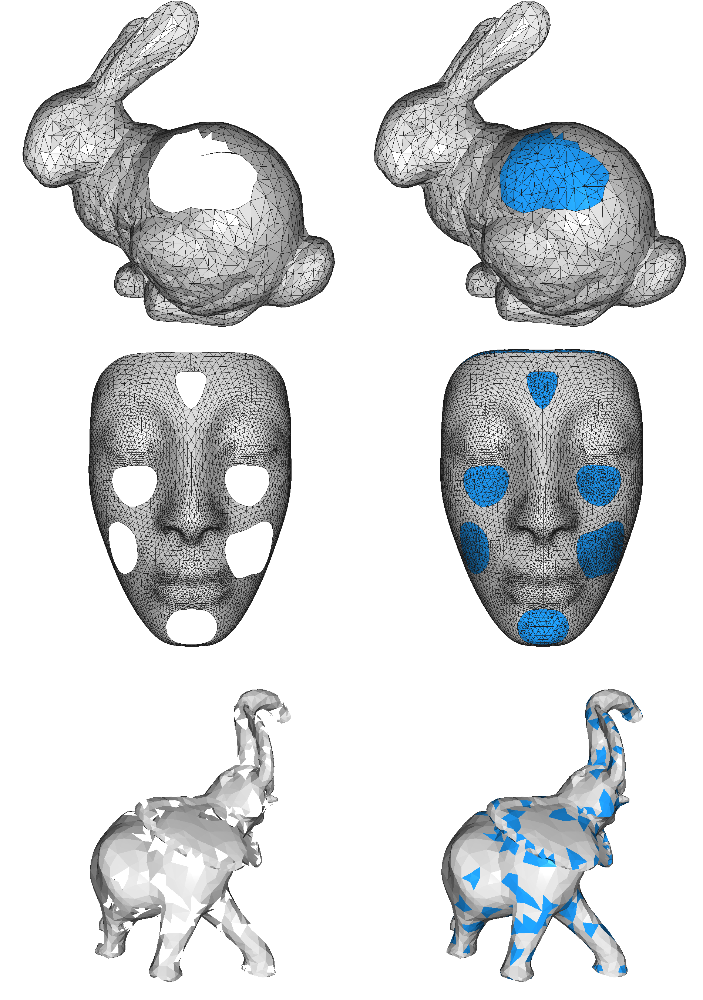

# HoleFillingPy
A dirty implementation of mesh hole filling with [libigl](https://github.com/libigl/libigl-python-bindings).



## Dependencies
```bash
conda install -c conda-forge igl
```

## Usage
Run `main.py` to see the result.


## Reference
Liepa, Peter. "Filling holes in meshes." Proceedings of the 2003 Eurographics/ACM SIGGRAPH symposium on Geometry processing. 2003.
